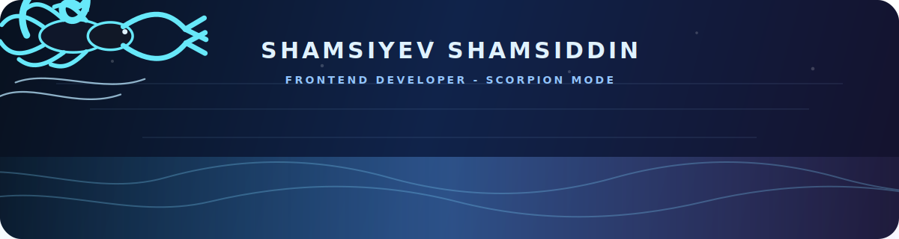

<p align="center">
  
</p>

<h1 align="center">Shamsiddin Shamsiyev</h1>

<p align="center">
  <b>Frontend Developer</b> &nbsp;|&nbsp; <b>Web Projects</b> &nbsp;|&nbsp; <b>Backend Learning</b> &nbsp;|&nbsp; <b>Bot Systems</b>
</p>

<p align="center">
  
</p>

<p align="center">
  <a href="https://instagram.com/shamsiddin_shamsiyevv">
    
  </a>
  <a href="https://t.me/shamsiyev_shamsiddin">
    
  </a>
  <a href="https://t.me/soft_area">
    
  </a>
  
</p>

---

<table>
  <tr>
    <td width="58%">
      <h3>Mission Control</h3>
      <p>
        I build practical web projects, improve my coding discipline every day,
        and move step by step from frontend interfaces into stronger backend systems.
      </p>
      <ul>
        <li>Clean UI, responsive layout, and real project practice</li>
        <li>Frontend foundation with HTML, CSS, JavaScript, and TypeScript</li>
        <li>Python and backend learning for stronger full-stack skills</li>
        <li>Telegram bot projects, websites, and automation experiments</li>
      </ul>
    </td>
    <td width="42%">
      <h3>Developer Status</h3>
      <p>
        
      </p>
      <p>
        
      </p>
      <p>
        
      </p>
    </td>
  </tr>
</table>

---

<h2 align="center">Tech Arsenal</h2>

<p align="center">
  
</p>

<p align="center">
  
  
  
  
</p>

---

<h2 align="center">GitHub Interface</h2>

<p align="center">
  
  
</p>

<p align="center">
  
</p>

<p align="center">
  
</p>

---

<h2 align="center">Build Protocol</h2>

```txt
profile.shamsiddin
  role      -> frontend developer
  mode      -> scorpion focus
  projects  -> websites, bots, learning systems
  standard  -> clean code, sharp UI, steady growth
```

<p align="center">
  <b>Thanks for visiting my profile.</b>
</p>
